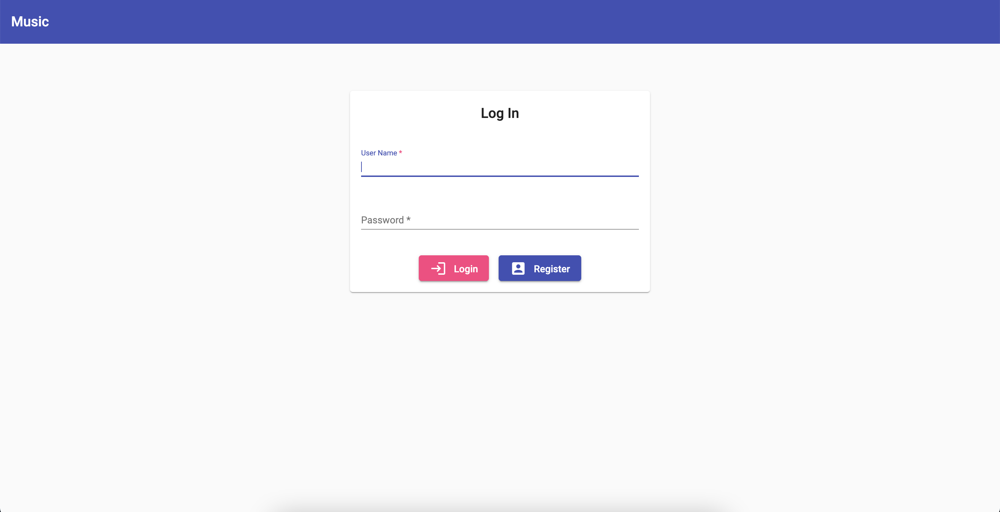
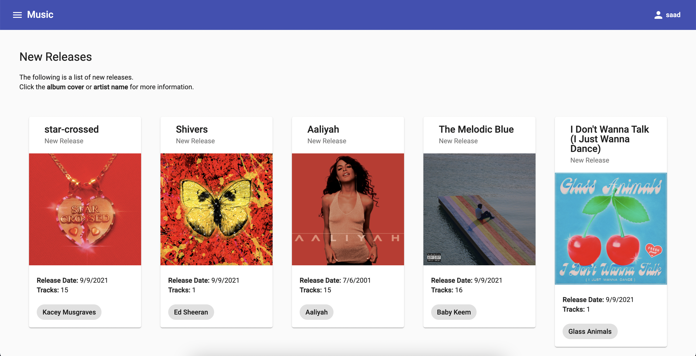
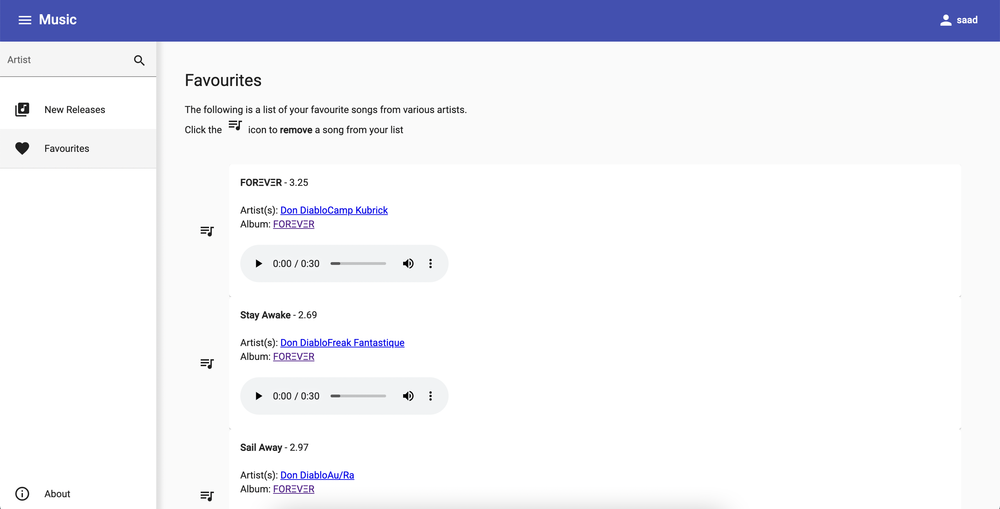

# Angular Spotify Project

A website to browse new releases on Spotify and store a list of favorite songs. Link to the website: https://angular-spotify-project.vercel.app

## Objectives

- Build a fully functional website using Angular.
- Store data using MongoDB.

## Usage

Register an account on the website (no email required). Browse albums and artists and save songs to favourites.

## Screenshots

